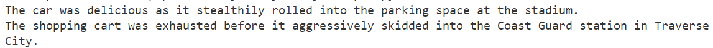

# Variables: Writing a Silly Story

## Objective

> *Define and assign values to several Python variables*
>
> *Use the variables to write a silly story in Visual Studio Code*


## Sample Output



## General Specifications

- Add a comment block 
```python
# Abraham Lincoln
# 24 MAR 20XX
# Intro to Python Variables
```
- Use short, descriptive filenames
- Write your filenames in lowercase

## Resources & Examples

- [Python variables and data type examples](https://www.programiz.com/python-programming/variables-constants-literals)
- [Python f-strings](https://www.w3schools.com/python/trypython.asp?filename=demo_fstring_placeholder)

## Project Tasks

- Read the instructions and review the project resources
- Create a GitHub repo named: **silly-story-python**
    - Upload your project files to the repo
    - Submit the URL to your repo on Google Classroom
 
## Directions

- In your silly story repo, create a new file named `main.py`
- Don't forget to add a comment block to the top of your script
- Define (create) 5 - 6 variables; assign a string to some of the variables, and numbers to the remaining varibles
```python
color = 'tangerine'
adjective = 'foggy'
verb_form_past = 'slithered'
number_of_pizzas = 5
```
-  Use the `print()` function and `f-strings` to help Python display your silly story on your screen

## With Your Assigned Partner

- Check your partner's silly story and give them some helpful and specific feedback
    - Did your partner use a variety of variables to create the silly story?
    - Did your partner follow the guidelines for naming Python variables?
         - Variable names written in lowercase
         - Used a short, descriptive name for each variable
         - Used underscore (_) for variable names made up of two or more words (`first_name`, `num_aliens`, `final_score`, etc.)
     - Are there any syntax errors?
     - Any logic errors?
     - What about spelling and grammar?  Are both correct?
     - How could your partner's silly story be improved?
 
## Silly Story 2.0

- Add a few more variables
- Make your story a little longer using `f-strings` and your extra variables
